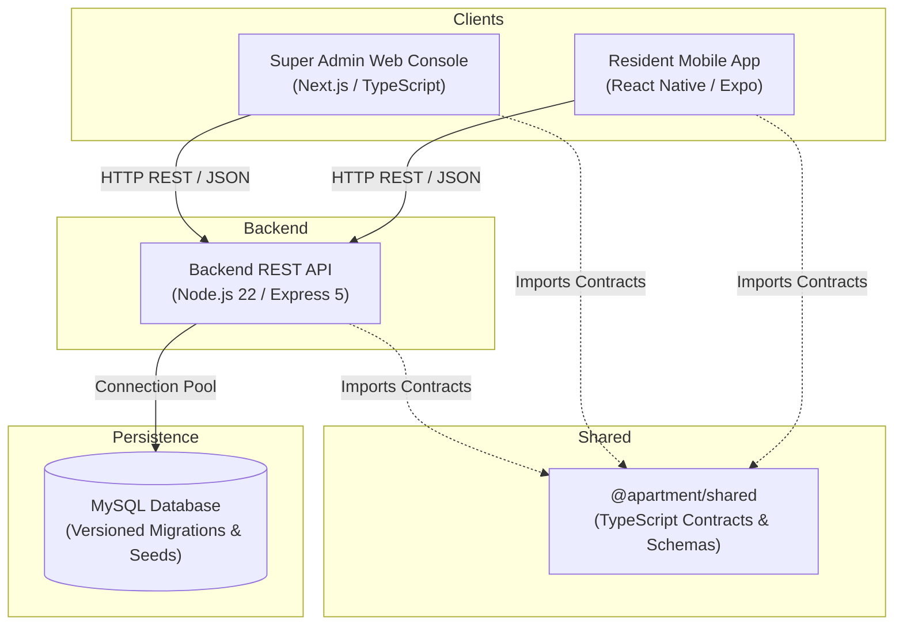

# Apartment Management Platform: Monorepo Architecture Specification

## 1. System Overview

The Apartment Management Platform is architected as a cross-platform modular monorepo that separates client channels, API services, and database concerns while providing unified TypeScript contracts and validation models.

## 2. Platform Tiers

### A. Tenant / Resident Mobile Application (`apps/mobile`)
- **Technology:** React Native, Expo SDK, TypeScript.
- **Audience:** Resident Flat Owners, Tenants, and Approved Household Members.
- **Delivery:** Expo Go for rapid local testing; EAS Build / TestFlight for production distribution.
- **Architectural Principle:** Pure native UI components (View, Text, ScrollView, StyleSheet). **No WebView wrapping.**

### B. Super Admin Web Console (`apps/admin-web`)
- **Technology:** Next.js (App Router), TypeScript.
- **Audience:** Authorized Super Admin and Property Management Committee.
- **Delivery:** Responsive web deployment.
- **Architectural Principle:** Secure administrative interface for managing community configuration, units, residents, billing, and operational workflows.

### C. Backend API Service (`apps/api`)
- **Technology:** Node.js 22 LTS, Express 5, TypeScript.
- **Architecture Pattern:** Clean Layered Architecture (`routes` -> `controllers` -> `services` -> `repositories` / data access).
- **Communication:** Strict REST / JSON envelope with standard success and error schemas.
- **Security Boundaries:** Server-side authentication, role authorization, resource ownership checks, and Zod input validation.

### D. Shared Contracts (`packages/shared`)
- **Technology:** TypeScript.
- **Purpose:** Single source of truth for DTOs, API responses, error codes, and provisional user roles.

### E. Database Layer (`database/`)
- **Technology:** MySQL with versioned SQL migrations and seed data.
- **Target:** Staging and production MySQL instances (Hostinger-native baseline).

## 3. Role-Based Access Control & Security Architecture

On Day 7, full server-side Role-Based Access Control (RBAC) and resource ownership enforcement are active across all endpoints:

### Supported Roles:
- **`SUPER_ADMIN`**: Full platform authority across properties, units, resident accounts, finances, maintenance assignments, notices, documents, and audit logs.
- **`COMMITTEE_MEMBER`**: Society governance, executive reviews, and committee oversight.
- **`RESIDENT_OWNER`**: Flat owner residing in the community. Has access to personal unit, household, vehicles, gate passes, maintenance, amenities, and owner-only statutory documents (`OWNERS_ONLY`). Strictly denied access to Super Admin APIs (HTTP 403 Forbidden).
- **`RESIDENT_TENANT`**: Resident tenant with household, vehicle, gate pass, maintenance, and amenity booking privileges. Strictly shielded from `OWNERS_ONLY` and `ADMIN_ONLY` documents, and denied access to Super Admin APIs (HTTP 403 Forbidden).
- **`SECURITY_GUARD`**: Gate security personnel with visitor registry and gate pass verification rights.
- **`MAINTENANCE_STAFF`**: Field technicians for servicing assigned maintenance tickets.
- **`SERVICE_VENDOR`**: External contractors servicing scheduled facility jobs.

### Resource Ownership & IDOR Protection:
Every authenticated resident request strictly verifies that the accessed resource (household member, vehicle, maintenance ticket, dues ledger, unit details) belongs to the user's actively assigned flat (`unit_id`). Probing another flat's records is rejected with `HTTP 403 FORBIDDEN`.

