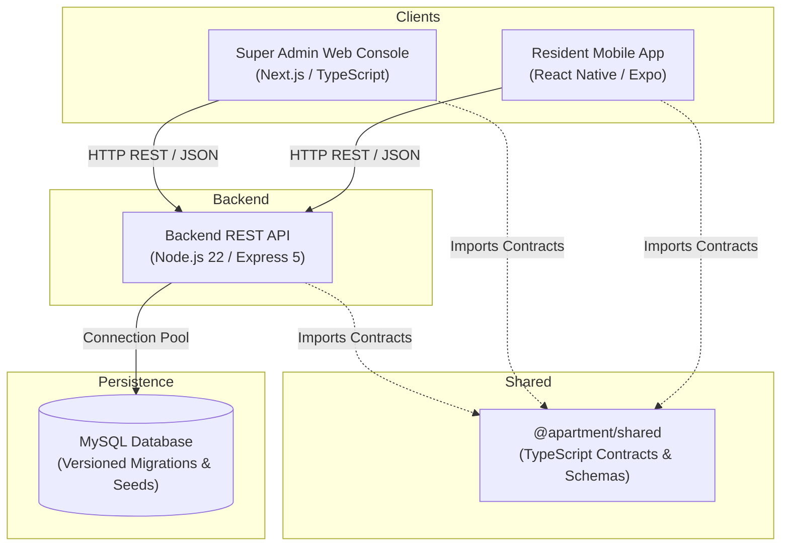

# Apartment Management Platform: Monorepo Architecture Specification

## 1. System Overview

The Apartment Management Platform is architected as a cross-platform modular monorepo that separates client channels, API services, and database concerns while providing unified TypeScript contracts and validation models.

## 2. Platform Tiers

### A. Tenant / Resident Mobile Application (`apps/mobile`)
- **Technology:** React Native, Expo SDK, TypeScript.
- **Audience:** Resident Flat Owners, Tenants, and Approved Household Members.
- **Delivery:** Expo Go for rapid local testing; EAS Build / TestFlight for production distribution.
- **Architectural Principle:** Pure native UI components (View, Text, ScrollView, StyleSheet). **No WebView wrapping.**

### B. Super Admin Web Console (`apps/admin-web`)
- **Technology:** Next.js (App Router), TypeScript.
- **Audience:** Authorized Super Admin and Property Management Committee.
- **Delivery:** Responsive web deployment.
- **Architectural Principle:** Secure administrative interface for managing community configuration, units, residents, billing, and operational workflows.

### C. Backend API Service (`apps/api`)
- **Technology:** Node.js 22 LTS, Express 5, TypeScript.
- **Architecture Pattern:** Clean Layered Architecture (`routes` -> `controllers` -> `services` -> `repositories` / data access).
- **Communication:** Strict REST / JSON envelope with standard success and error schemas.
- **Security Boundaries:** Server-side authentication, role authorization, resource ownership checks, and Zod input validation.

### D. Shared Contracts (`packages/shared`)
- **Technology:** TypeScript.
- **Purpose:** Single source of truth for DTOs, API responses, error codes, and provisional user roles.

### E. Database Layer (`database/`)
- **Technology:** MySQL with versioned SQL migrations and seed data.
- **Target:** Staging and production MySQL instances (Hostinger-native baseline).

## 3. Provisional Role Notice
All user role definitions currently defined in `@apartment/shared` are **provisional design baselines** derived from the reference package and are pending senior developer confirmation. No role-based access control (RBAC) or authorization gates are enforced on Day 1.
