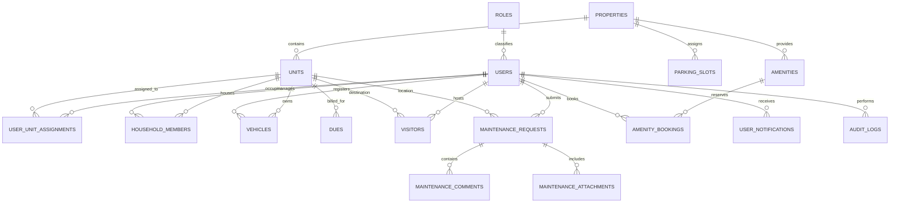

# Apartment Management Platform: Database Schema & Migrations

**Engine**: MySQL 8.0+  
**Collation**: `utf8mb4_unicode_ci`  
**Storage Engine**: InnoDB (ACID compliant with Foreign Key constraints)

---

## 1. Entity-Relationship Overview

---

## 2. Table Specifications

### 2.1 Core Identity & RBAC
- **`roles`**: System roles defining access level (`SUPER_ADMIN`, `COMMITTEE_MEMBER`, `RESIDENT_OWNER`, `RESIDENT_TENANT`, `SECURITY_GUARD`, `MAINTENANCE_STAFF`, `SERVICE_VENDOR`).
- **`users`**: System users storing unique `id` (UUID), `email`, `password_hash` (bcrypt cost 10), `full_name`, `phone_number`, `role_id`, and `is_active` boolean.
- **`pending_onboarding`**: Self-service applicant queue capturing `full_name`, `email`, `password_hash`, `phone_number`, `unit_number`, `block`, `applicant_role`, and `status` (`PENDING_APPROVAL`, `APPROVED`, `REJECTED`).

### 2.2 Property & Inventory
- **`properties`**: Community master record (`id`, `code`, `name`, `address_line1`, `address_line2`, `city`, `state`, `postal_code`, `total_blocks`, `total_units`, `contact_phone`, `emergency_phone`, `rules_summary`, `payment_instructions`).
- **`units`**: Residential inventory (`id`, `property_id`, `unit_number`, `block`, `floor`, `square_feet`, `unit_type`, `status`: `OCCUPIED` | `VACANT` | `UNDER_MAINTENANCE`).
- **`user_unit_assignments`**: M2M tenancy/ownership link (`user_id`, `unit_id`, `assignment_type`: `OWNER` | `TENANT`, `is_primary`, `valid_from`, `valid_to`, `status`: `ACTIVE` | `TERMINATED`).

### 2.3 Extended Community Verticals
- **`household_members`**: Family and co-residents (`id`, `unit_id`, `resident_user_id`, `full_name`, `relationship`, `phone_number`, `emergency_contact`).
- **`vehicles`**: Registered vehicles (`id`, `unit_id`, `resident_user_id`, `registration_number`, `vehicle_type`: `TWO_WHEELER` | `FOUR_WHEELER` | `BICYCLE`, `make_model`, `is_electric`).
- **`parking_slots`**: Community parking bay allocation (`id`, `property_id`, `slot_number`, `block`, `assigned_unit_id`, `is_ev_ready`, `status`).

### 2.4 Operations & Security
- **`visitors`**: Gate entries & pre-approved passes (`id`, `property_id`, `unit_id`, `host_user_id`, `visitor_name`, `visitor_phone`, `pass_code`, `purpose`, `status`: `EXPECTED` | `CHECKED_IN` | `CHECKED_OUT` | `EXPIRED`).
- **`maintenance_requests`**: Service tickets (`id`, `unit_id`, `resident_user_id`, `category`, `title`, `description`, `priority`, `status`: `OPEN` | `IN_PROGRESS` | `RESOLVED` | `CANCELLED`, `assigned_to_user_id`).
- **`maintenance_comments`**: Staff and resident discussion thread (`id`, `request_id`, `author_user_id`, `comment`, `is_internal`).
- **`maintenance_attachments`**: Validated defect photos (`id`, `request_id`, `file_name`, `file_path`, `mime_type`, `file_size_bytes`).
- **`dues`**: Recurring maintenance and billing ledger (`id`, `unit_id`, `title`, `description`, `amount_cents`, `currency`, `due_date`, `status`: `PENDING` | `PAID` | `OVERDUE`, `paid_at`).
- **`amenities`**: Society facilities (`id`, `property_id`, `name`, `description`, `capacity`, `booking_lead_days`, `opening_time`, `closing_time`, `is_active`).
- **`amenity_bookings`**: Slot reservations (`id`, `amenity_id`, `user_id`, `unit_id`, `booking_date`, `start_time`, `end_time`, `purpose`, `status`: `CONFIRMED` | `CANCELLED`).
- **`notices`**: Broadcast communications (`id`, `property_id`, `title`, `content`, `priority`: `LOW` | `NORMAL` | `URGENT`, `published_by_user_id`, `published_at`).
- **`documents`**: Compliance repository (`id`, `property_id`, `title`, `category`: `APARTMENT_BYLAWS` | `FIRE_SAFETY` | `LIFT_AMC` | `AGM_MINUTES` | `FINANCIAL_AUDIT`, `access_level`: `ALL_RESIDENTS` | `OWNERS_ONLY` | `ADMIN_ONLY`, `file_url`).
- **`user_notifications`**: In-app resident inbox (`id`, `user_id`, `title`, `body`, `type`, `is_read`, `created_at`).
- **`audit_logs`**: Immutable security trail (`id`, `actor_user_id`, `action`, `resource_type`, `resource_id`, `ip_address`, `user_agent`, `details_json`, `created_at`).

---

## 3. Versioned Migrations

All schema changes are versioned in `database/migrations/`:

| Migration File | Description |
| :--- | :--- |
| `001_roles_users_properties_units.sql` | Foundational DDL: `roles`, `users`, `properties`, `units`, `user_unit_assignments`. |
| `002_core_features.sql` | Operational DDL: `visitors`, `maintenance_requests`, `maintenance_comments`, `dues`, `amenities`, `amenity_bookings`, `notices`, `audit_logs`. |
| `003_extended_features.sql` | Advanced DDL: `documents`, `household_members`, `vehicles`, `parking_slots`, `maintenance_attachments`, `user_notifications`, `pending_onboarding`. |

---

## 4. Deterministic Seeds

All seed datasets are versioned in `database/seeds/`:

| Seed File | Contents |
| :--- | :--- |
| `001_initial_users_and_properties.sql` | Demo property (Greenfield Heights), 5 demo units, Super Admin (`admin@community.local`), Preetham (`preetham@community.local`), Vikramaditya (`vikramaditya@community.local`), Ananya Sharma (`ananya.sharma@community.local`), Rahul Verma (`rahul.verma@community.local`). |
| `002_core_features.sql` | Pre-populated maintenance requests, gate visitor passes, maintenance dues, amenities (Banquet Hall, Pool, Tennis Court), and community notices. |
| `003_extended_features.sql` | Initial household members, registered vehicles, parking slot mapping, statutory documents with role access levels, and user notification messages. |

---

## 5. Development In-Memory Persistence Fallback

If a live MySQL instance is not connected during local development or CI, the backend repository layer (`apps/api/src/repositories/`) transparently uses in-memory mock stores initialized from the identical schema and seed specifications. This ensures 100% test reproducibility across all client and backend tests without requiring a local database server.
